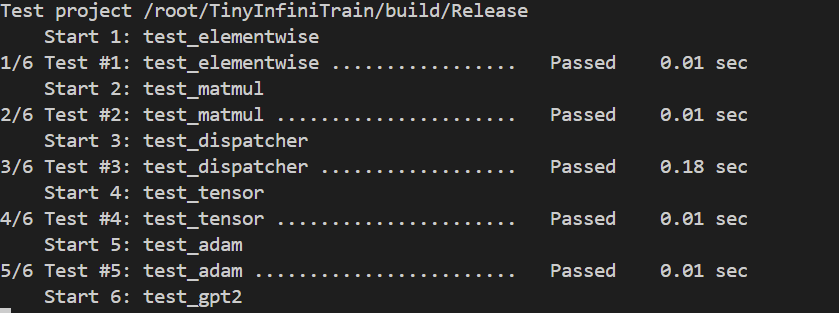

# TinyInfiniTrain 作业报告

## 1. Test 结果

## 2. 作业实现说明（按作业项）
### 作业一：Neg autograd 调用
- 解决思路：在 `infini_train/src/autograd/elementwise.cc` 通过 Dispatcher 获取 `NegForward/NegBackward` kernel，并直接返回对应 Tensor。

### 作业二：Matmul 实现
- 解决思路：  
  - CPU `infini_train/src/kernels/cpu/linear.cc`：用 Eigen 按批次做矩阵乘，前向批矩阵乘，反向计算 `dA = G*B^T`、`dB = A^T*G`。  
  - CUDA `infini_train/src/kernels/cuda/linear.cu`：使用 cuBLAS `sgemm` / `sgemmStridedBatched` 完成前向与反向，同步批维一致性。

### 作业三：Adam 优化器
- 解决思路：CPU/CUDA 均实现公式更新 m、v，加偏置校正后更新参数，位置见 `accumulate_grad.cc/cu`。

### 作业四：Tensor 基础
- 解决思路：  
  - `Tensor::Flatten` 计算 start–end 维度乘积并使用 `View` 返回新形状。  
  - `Tensor::Backward` 若无外部梯度生成全 1，叶子累加到 `grad_`，非叶子通过 `grad_fn_` 继续反传。

### 作业五：Dispatcher 注册
- 解决思路：`infini_train/include/dispatcher.h` 完成通用 Call、重复注册保护与自动注册宏，支持按设备查找 kernel。

### 作业六：GPT-2 数据与 Tokenizer
- 解决思路：  
  - `example/common/tiny_shakespeare_dataset.cc` 解析 1024B 头 + token 数据，按 `seq_len` 重塑为 `{num_seq, seq_len}`，operator[] 生成滑窗样本。  
  - `example/common/tokenizer.cc` 读取头信息、词表，提供 Decode；GenerateText 贪心采样 logits 输出文本。
- 遇到问题：未验证生成效果，缺少实际数据文件。

## 3. 备注与问题
- 数据文件（tiny_shakespeare / tokenizer 等）未提供，相关测试需准备后再跑。
- 行尾目前为 Windows 换行，如需可统一转换为 LF。
